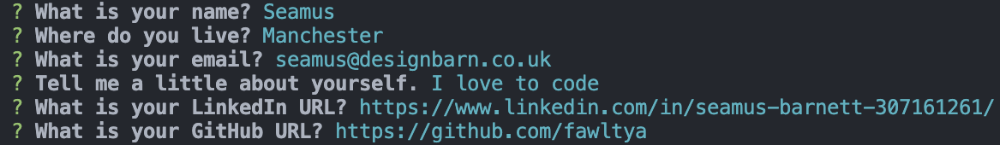

# Automatic Portfolio Creator

## Description
This application lets you fill out a short quiz and uses the answers to populate content in a fresh index.html webpage. Comes with pre-done styling and node.js.


## Usage
Download the package.

Open up terminal, navigate to where the downloaded folder is and type the following command:
```javascript
node index.js
```
Answer the questions that pop up in the terminal window and once finished a new index.html file will be created. Try opening it in a browser to see the results!



## License 
[MIT](https://choosealicense.com/licenses/mit/)
